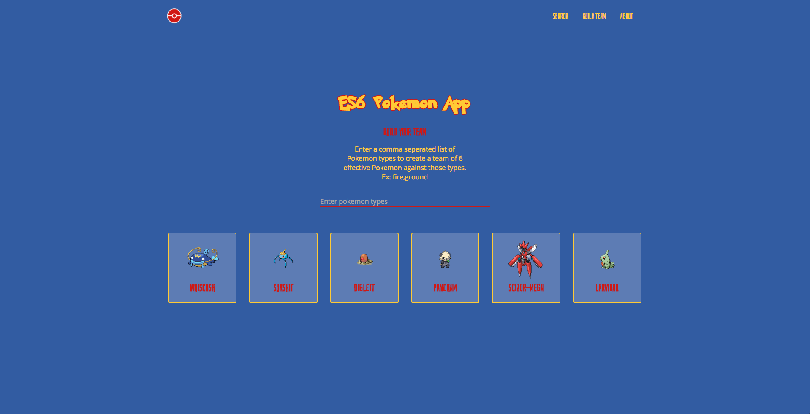

# Pokemon ES6 App

A simple pokemon app that utilizes new technologies including ES6, Flexbox and new CSS3 features. Search for info on a specific Pokemon or build an effective team against certain types of Pokemon.

Based off this awesome ES6 [tutorial](https://www.youtube.com/watch?v=SdBs0CX9MFg) by Ryan Christiani.

[DEMO](https://pokemon-es6-app.herokuapp.com)

Features Used:

* arrow functions
* const/let
* promises (asynchronous API calls)
* spread operator
* fetch
* css variables
* flexbox

